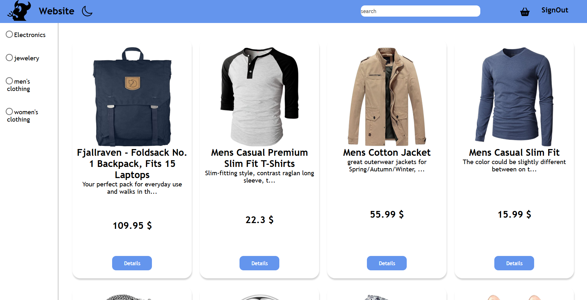

# 🛒 E-Commerce Website

Modern bir e-ticaret web uygulaması.  
Kullanıcılar ürünleri listeleyebilir, sepete ekleyebilir ve kullanıcı girişi yapabilir.

Bu proje frontend yeteneklerimi geliştirmek ve gerçek bir ürün mantığını öğrenmek amacıyla yapılmıştır.

---

## 🛠️ Kullanılan Teknolojiler

- React
- Redux Toolkit
- React Router
- Firebase Authentication
- Formik & Yup
- JavaScript
- CSS

---

## ✨ Özellikler

- 🔐 Kullanıcı kayıt & giriş sistemi (Firebase Auth)
- 🛍️ Ürün listeleme
- ➕ Sepete ürün ekleme / çıkarma
- 🧮 Sepet toplam tutar hesaplama
- ✅ Form validasyonu (Formik & Yup)
- 📱 Responsive tasarım

---

## 📸 Ekran Görüntüsü

